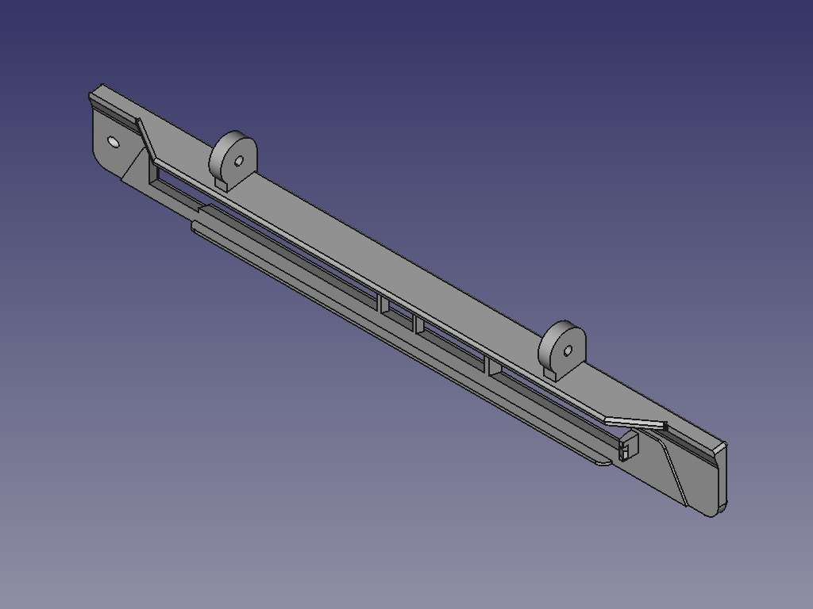
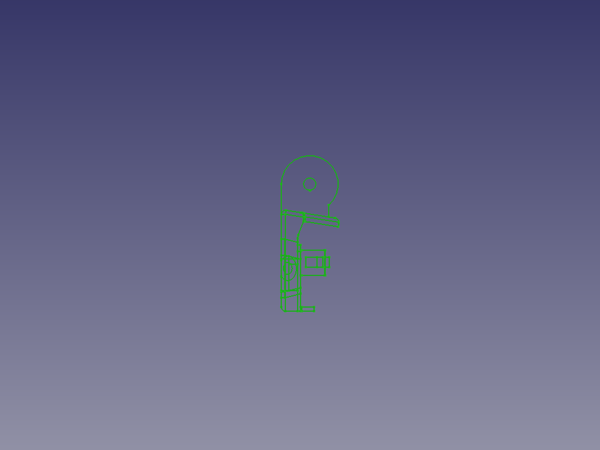
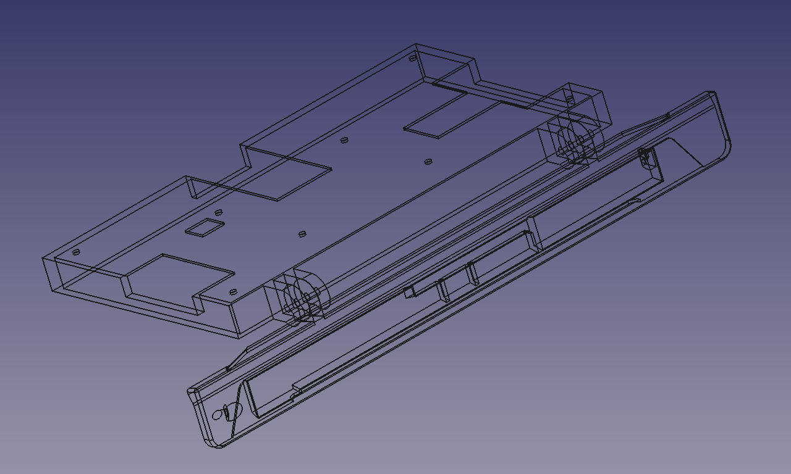
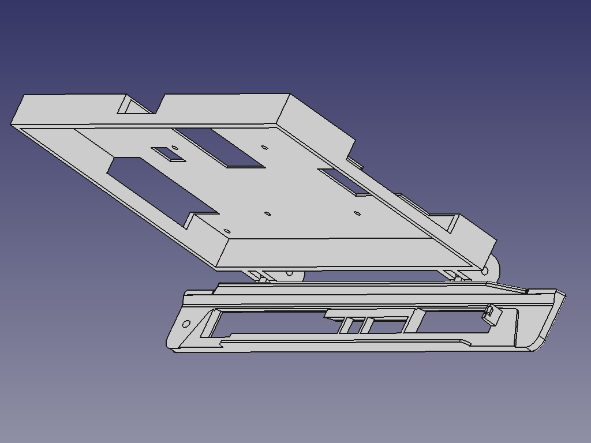
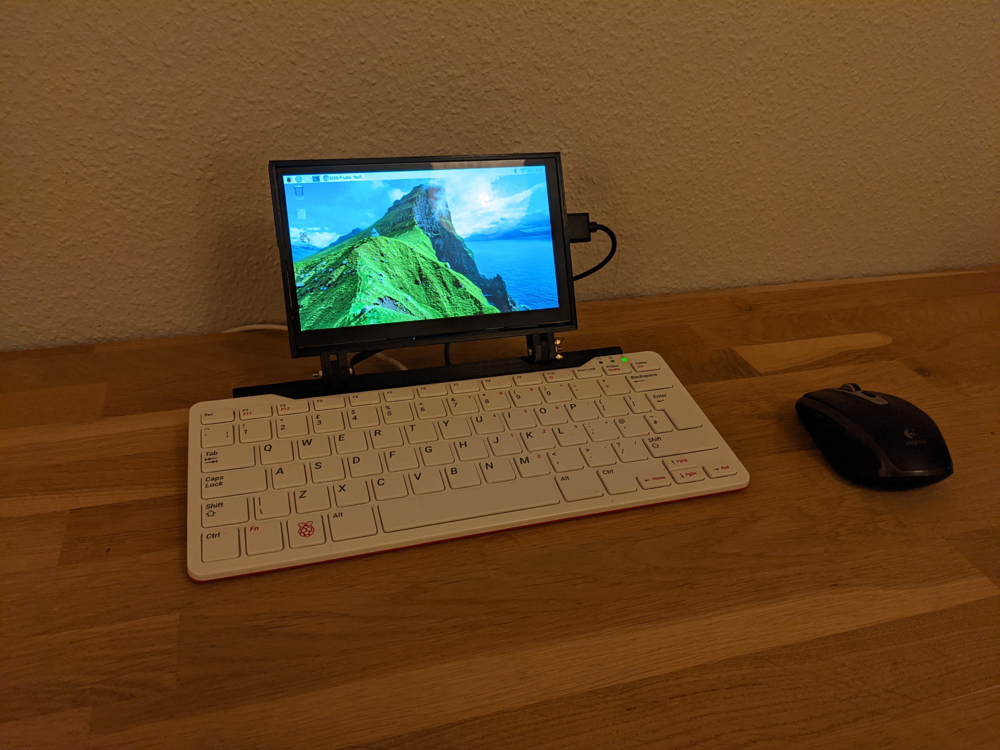
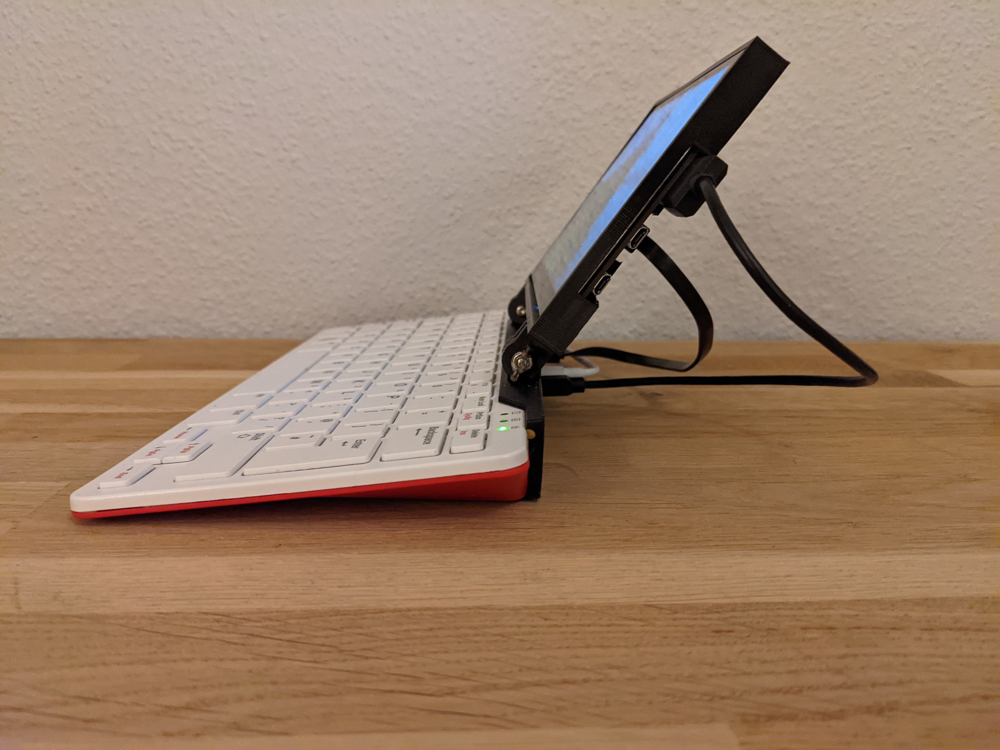
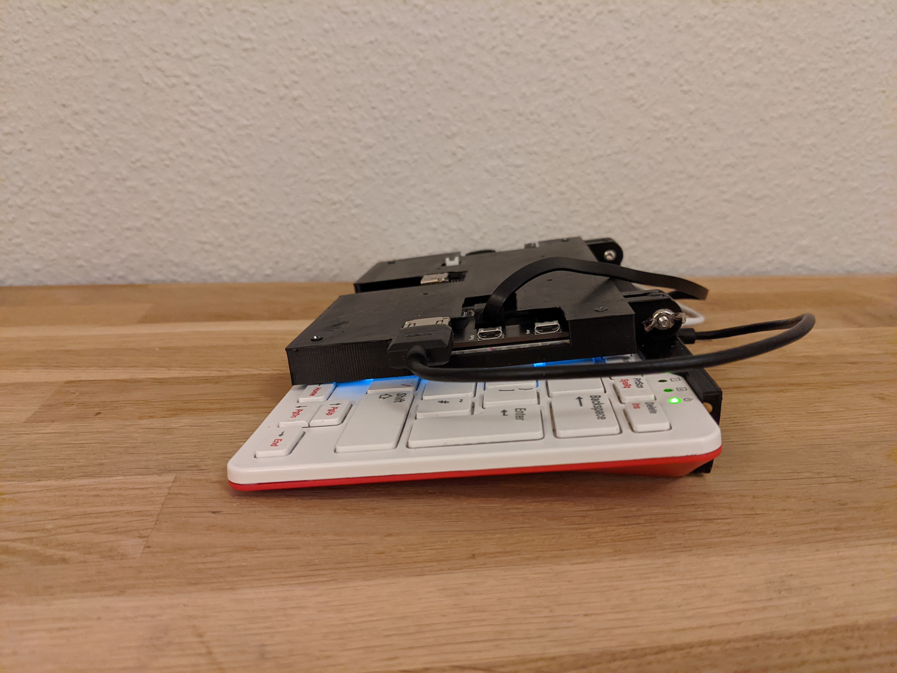

#### A screen mount for the Raspberry Pi 400  

A non-destructive 3d-printed mount for the Raspberry Pi 400. Uses a single M3 screw to secure to the PI400 via the Kensingon lock opening.  

New:  
I finally got my 7" display (Elecrow RC070S), but unfortunately the rear HDMI socket seems dead, so I'll be using the side connection for now. Audio and touch seem to work, and it has a nice OSD with a control knob on the side for backlight brihtness and volume. I have re-done the hinges on the base and made a new 7" screen frame to fit. I wanted to use a wing nut (shaved down slightly) so I can adjust the hinge tension on the fly, and that seems to work brilliantly.   

Old:  
I'm waiting for 7" display with built in speakers (and touch) - Elecrow RC070S. I am currently using a generic 5"  
An Angled Micro HDMI to HDMI with FPV ribbon cable would work nicely - [Similar to this, but shorter](https://www.amazon.de/-/en/Degrees-Angled-Multicopter-Aerial-Photography/dp/B072PVG4B4)   

#### BOM:  
Mount:  
3x M3 screws, between 16 and 25 mm    ~€1  
2x M3 locking nut                     ~€1  
1x M3 thread cutting tool (optional)  ~€3  
Display and connections:   
1x Display                            ~€80  
1x Micro HDMI to HDMI cable           ~€10  
1x Power                              ~€1  

#### Print instructions:  
Fill walls up to 2 mm, or the tab in the GPIO end will break. Alternatively, print it 100% solid.  
Note that the screen frame is TEMPORARY, and you can make one suitable for your needs. I will make a proper screen frame once I have my target display.  
Cut a suitable 3mm thread for the screw in the hole going into the Kensington lock hole, AND in all of the hinge holes.  

#### NEW Pics (7 inch version)

#### OLD Pics (5 inch version)  

