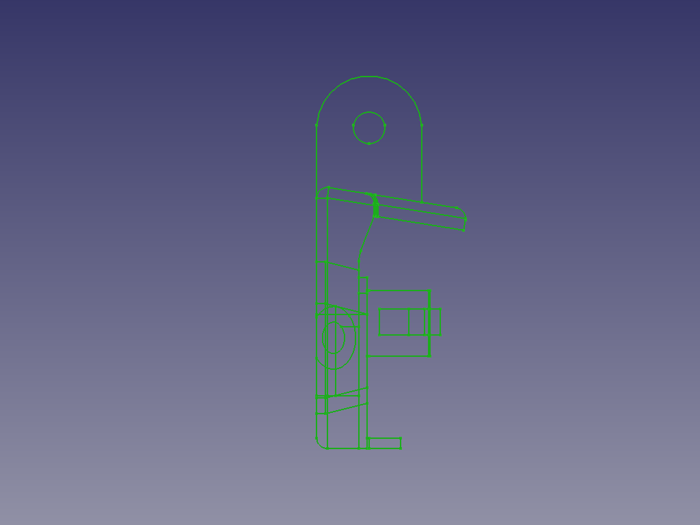
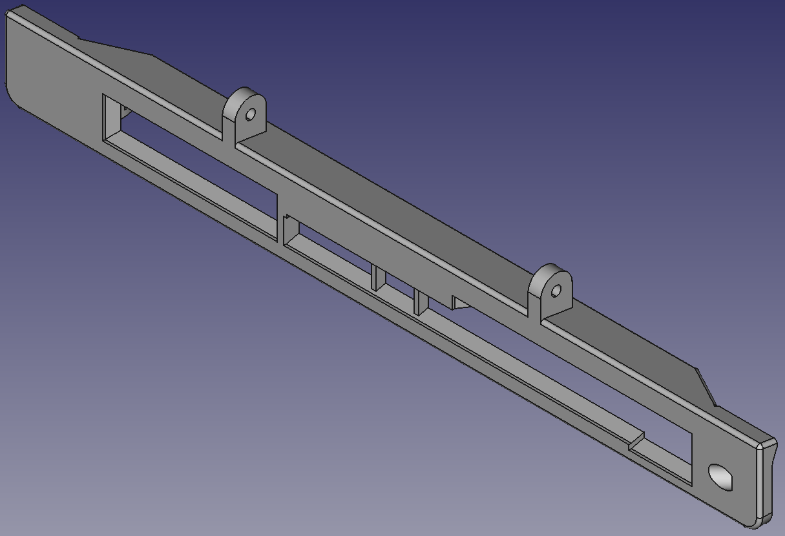
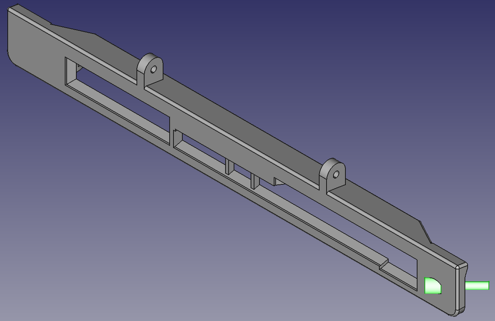
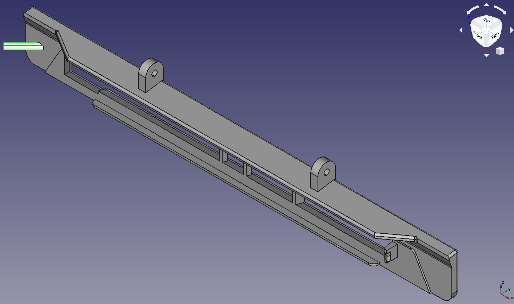
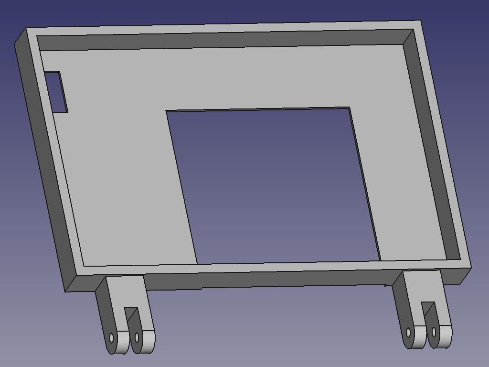
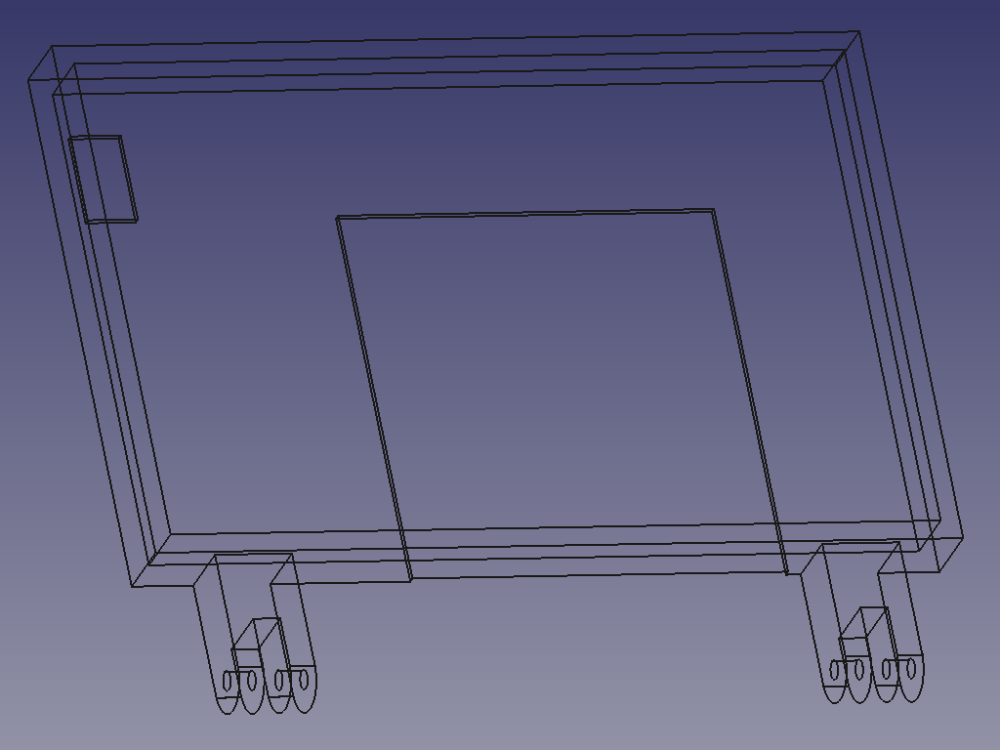

# pi400-mount
A screen mount for the Raspberry Pi 400  

A non-destructive 3d-printed mount for the Raspberry Pi 400. Uses a single M3 screw to secure to the PI400 via the Kensingon lock opening.  

I'm waiting for an Elecrow RC070S, currently using a generic 5" 
An Angled Micro HDMI to HDMI with FPV ribbon cable would work nicely - [Similar to this, but shorter](https://www.amazon.de/-/en/Degrees-Angled-Multicopter-Aerial-Photography/dp/B072PVG4B4)  

BOM:  
Mount:  
3x M3 screws, between 16 and 25 mm    ~€1  
2x M3 locking nut                     ~€1  
Display and connections:  
1x Display                            ~€80  
1x Micro HDMI to HDMI cable           ~€10  
1x Power                              ~€1  

